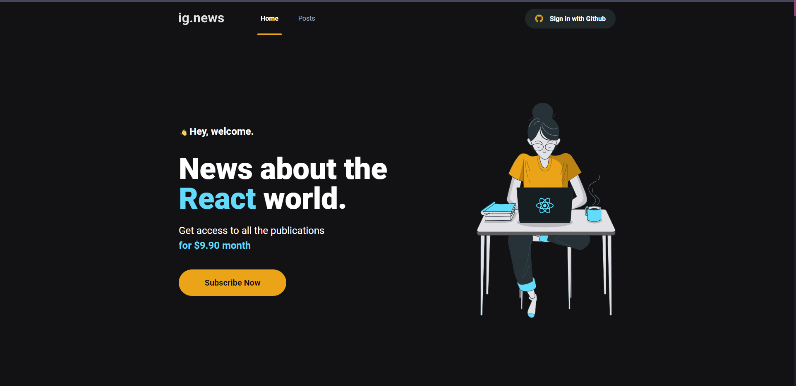

<h1 align="center">
    
</h1>

<br>

## 📖 IG.News

IG.News é um blog onde os usuários podem ter acesso aos conteúdos de cada postagem, de acordo com o status de sua assinatura.

- Fazer Login via github;
- Fazer uma assinatura via Stripe;
- Ler os previews de cada postagem, caso não seja assinante;;
- Ler os posts;

Esta aplicação foi construida, durante o curso IGNITE da RocketSeat.

## 🛠 Tecnologias

Esse projeto foi desenvolvido com as seguintes tecnologias:

- Next.js;
- Typescript
- SASS
- Stripe
- FaunaDB
- Prismic CMS


## 🚀 Como executar

Clone o projeto e acesse a pasta do mesmo.

```bash
$ git@github.com:luizsmatos/ignews.git
$ cd ignews
```

Para iniciá-lo, siga os passos abaixo:
```bash
# Instalar as dependências
$ yarn

# Iniciar o projeto
$ yarn dev
```

---
